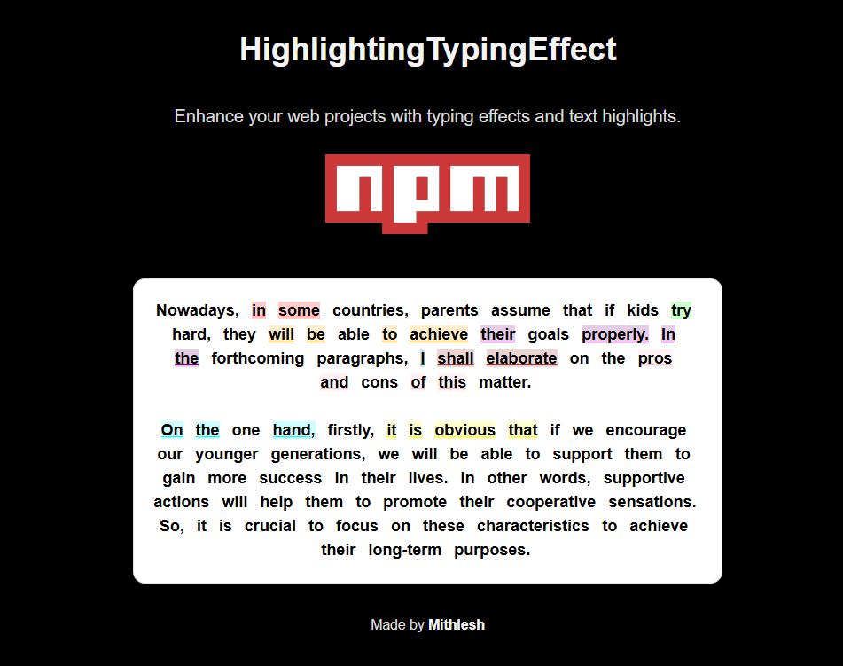

# TypingEffectWithHighlights
<div style="text-align: center;">
  
</div>


A React component that simulates a typing effect while highlighting specific words based on the provided JSON data. The component types out the content word-by-word and applies dynamic highlights with customizable colors.

## Features

- **Typing Effect**: Displays text with a typewriter effect, revealing one word at a time.
- **Dynamic Word Highlighting**: Highlight specific words based on indices and colors provided in the JSON object.
- **Customizable Typing Speed**: Control the speed of the typing effect with an adjustable interval.
- **Customizable Highlight Colors**: Supports dynamic background color and underline styles for highlighted words.

## Installation

To install the package, run:

```
npm install typing-effect-with-highlights
```

## How to Use

### Importing the Component

You can import the `TypingEffectWithHighlights` component into your React application as follows:

```
import HighlightingTypingEffect from 'highlightingtypingeffect';
```

### Passing Data to the Component

You need to pass a JSON object with the text content and highlight data to the component. The object should include:

- `json`: An array of words that will be typed out.

### Example Usage

```
import React from 'react';
import TypingEffectWithHighlights from 'typing-effect-with-highlights';

const MyComponent = () => {
 const json = {
  text: "Nowadays, in some countries, parents believe that if kids try hard, they will achieve their goals. In the following paragraphs, I will explain the pros and cons. On one hand, encouraging younger generations can support their success. Supportive actions help them promote cooperative feelings, which are essential for long-term goals. Asking them to try harder can foster a sense of responsibility, boosting their mental well-being and self-esteem. For example, in the USA, parents sometimes monitor kids by buying gifts, allowing them to make mistakes and learn the best path. On the other hand, unrealistic goals can harm children’s motivation if they cannot achieve them. Setting realistic targets is crucial to avoid damaging their mental health. Consulting a psychologist may help prevent depression. In India, some therapists emphasize choosing achievable goals for well-being. In conclusion, setting optimal and achievable targets is important for mental health and success.",
  corrections: [
    { start_index: 10, end_index: 22, color: "red" },
    { start_index: 44, end_index: 50, color: "blue" },
    { start_index: 74, end_index: 83, color: "green" },
    { start_index: 90, end_index: 109, color: "orange" },
    { start_index: 129, end_index: 141, color: "purple" },
    { start_index: 174, end_index: 185, color: "teal" },
    { start_index: 200, end_index: 218, color: "brown" },
    { start_index: 230, end_index: 245, color: "pink" },
    { start_index: 267, end_index: 285, color: "cyan" },
    { start_index: 305, end_index: 317, color: "yellow" }
  ]
};

  return (
    <div>
      <TypingEffectWithHighlights
        json={json}
       interval={100} // Speed at which the words are typed (ms per word)
      />
    </div>
  );
};

export default MyComponent;
```

### Props

- `json`: Object or a json file containing text and array of objects containing corrections
- `interval`: Speed at which words are typed (in milliseconds per word).
